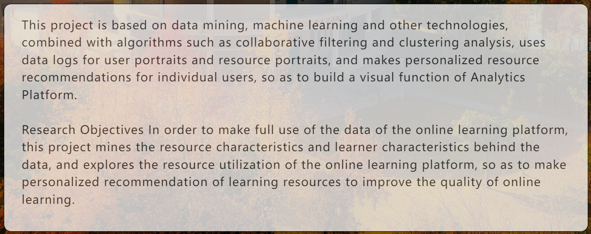
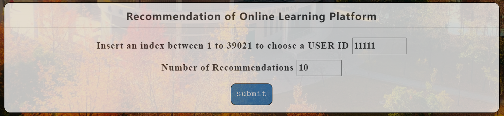
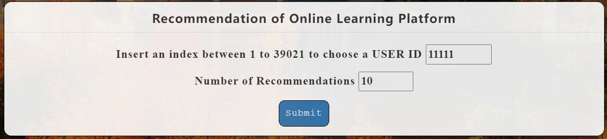
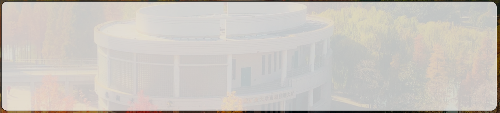
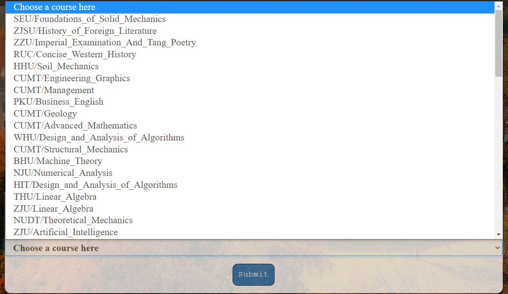
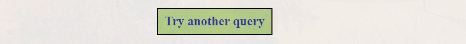

# 前端开发文档

## 1 前言

对于团队来说，为项目部署一套完整的开发文档可以减少团队协作成本和维护成本，让代码阅读起来更容易。


## 2 环境及版本说明

[HbuildX](https://www.dcloud.io/)	版本	3.1.22	

[Bootstrap](https://getbootstrap.com/	) 是最流行的 HTML、CSS 和 JS 框架，用于开发响应式布局、移动设备优先的 WEB 项目。	


## 3  代码及代码目录结构及代码文件功能说明

### 3.1 文档标题

- 代码`<title>text</title>`中，我们将`text`设置为项目简称Recommendation Generator。

- text 规定元素的工具提示文本（`tooltip text`）。
- title 属性规定关于元素的额外信息。

```html
<title>Recommendation Generator</title>
```


### 3.2 文档图标

- 代码中`rel="shortcut icon`"是一种固定写法。如果缺省该属性会影响`ico`图标的正确显示。这行代码通俗的讲就是告诉浏览器帮忙引入一个`ico`格式的图标，资源的地址在`href`中。

- link：元素可以用来引入HTML页面外部的资源文件。在Web开发过程中开发者会用link将CSS文件引入到页面中，当然也可以用link设置`ico`图标。
- rel ：表示将要引用的资源类型。
- href：表示指向资源的URL。

```html
<link href="../static/img/icon.svg" rel="shortcut icon">
```


### 3.3 无衬线英文字体

- Titillium作为视觉设计大师Campi Visivi的一个教学项目课程类型设计，诞生于Accademia di Belle Arti di Urbino。这种字体需要下载并放到`font`文件夹下。

- `font - family`属性指定一个元素的字体。
- `font-family` 可以把多个字体名称作为一个"回退"系统来保存。如果浏览器不支持第一个字体，则会尝试下一个。

```html
<style type="text/css">
	font-family: "Titillium Web";
</style>
```


### 3.4导航栏属性

- 我们将UPRR Web App字体设置为Titillium Web Bold，加粗，颜色为浅褐色。
- 我们将Home、Search、User Portrait以及Blog的名称字体设置为Titillium Web，颜色为浅褐色。

```html
<style type="text/css">
	#div5 {
				font-family: "Titillium Web Bold";
				font-weight: bold;
				color: beige;
			}
	#divbar {
				font-family: "Titillium Web";
				color: beige;
			}
</style>   
```


### 3.5 内容标题

- 为了与导航栏字体区分，我们将内容标题设置为Times New Roman格式。
- 字体颜色为浅褐色。
- `line-height`用于设置行高。

```html
<style type="text/css">
	#div1 {
				font-family: "Times New Roman";
				color: beige;
				line-height: calc(45px);
			}
</style>  
```


### 3.6 文字内容

- 我们采用`font-family`指定段落的字体为Titillium Web。
- `font-weight` 属性设置文本的粗细，`lighter`定义更细的字符。
- `font-size` 属性用于设置字体大小。
- `text-align`属性指定元素文本的水平对齐方式。`left`把文本排列到左边。
- `line-height`属性指定行高。

```html
<style type="text/css">
	#div2 {
				font-family: "Titillium Web ";
				font-weight: lighter;
				font-size: 20px;
				text-align: left;
				line-height: calc(30px);
			}
</style>  
```




### 3.7 文档背景

- `background-image` 属性设置一个元素的背景图像，注意路径格式。
- `background-repeat`属性定义背景图像的重复方式。背景图像可以沿着水平轴，垂直轴，两个轴重复，或者根本不重复。我们设置为`no-repeat`根本不重复。
- `background-attachment`属性决定背景图像的位置是在视口内固定，或者随着包含它的区块滚动。
- `text-align`属性定义行内内容如何相对它的块父元素对齐。`text-align` 并不控制块元素自己的对齐，只控制它的行内内容的对齐。我们设置为行内内容居中。
- `background-size`属性指定背景图像的大小。`cover`保持图像的纵横比并将图像缩放成将完全覆盖背景定位区域的最小大小。

```html
<style type="text/css">
	body {		
				/* 背景图片 */
        		background-image: url(../static/img/4.png);
				background-repeat: no-repeat;
				background-attachment: fixed;
				text-align: center;
				background-size: cover;
			}
</style>  
```


### 3.8 不透明度渐变效果

-  `background-color`设置元素的背景色, 属性的值为颜色值或关键字"transparent"二者选其一。
- `margin`属性为给定元素设置所有四个方向的外边距属性。`auto`让浏览器自己选择一个合适的外边距。有时，在一些特殊情况下，该值可以使元素居中。
- `opacity`属性指定了一个元素的不透明度。
- 渐变效果的初始不透明度`opacity`为0.75，最终不透明度`opacity`为0.9。
- `border`属性是一个用于设置各种单独的边界属性的简写属性。
- `font-weight`属性指定了字体的粗细程度。 一些字体只提供 `normal` 和 `bold` 两种值。
- `border-radius`设置元素的外边框圆角。当使用一个半径时确定一个圆形，当使用两个半径时确定一个椭圆。这个(椭)圆与边框的交集形成圆角效果。
- `filter`属性将模糊或颜色偏移等图形效果应用于元素。
- `padding`控制元素所有四条边的内边距区域。该属性是以下属性的简写：
  - `padding-bottom`
  - `padding-left`
  - `padding-right`
  - `padding-top`
- `onmouseout`指定鼠标移出盒子的状态，即初始不透明度`opacity`。`onmouseover`指定鼠标位于盒子处时的状态，即最终不透明度`opacity`。
- 每个 JavaScript 函数实际上都是一个 `Function` 对象。通过`Function`（） 创建一个新的 `Function` 对象`startrun`，识别run属性，实现函数功能。
- 函数中不透明度渐变效果的增加是按照`speed`的大小进行，我们设置为3。
-  `clearInterval()`方法可取消先前通过 `setInterval() `设置的重复定时任务。

```html
<style type="text/css">
	#run {
				width: 1000px;
				height: inherit;
				margin: 0 auto;
				background-color: #ffffff;
				/* background: #06c; */

				border: 1px solid black;
				/* border: 1px solid #000; */
				font-weight: bold;
				border-radius: calc(1.25rem);

				opacity: 0.75;
				filter: alpha(opacity=75);
				padding-top: calc(5px);
				padding-bottom: calc(5px);
			}
</style>  
<script>
			window.onload = function() {
				var run = document.getElementById("run");
				var btn = document.getElementById("btn");
				var speed = 1;
				var timer = null;
				var alpha = 75;
				run.onmouseover = function() {
					startrun(90);
				}
				run.onmouseout = function() {
					startrun(75);
				}

				function startrun(target) {
					clearInterval(timer);
					timer = setInterval(function() {
						if (target > alpha) {
							speed = 3;
						} else {
							speed = -3;
						}
						if (alpha == target) {
							clearInterval(timer);
						} else {
							alpha = alpha + speed;
							run.style.filter = 'alpha(opacity=' + alpha + ')';
							run.style.opacity = alpha / 100;
						}
					}, 75)
				}
			}
		</script>
```

鼠标没有接触盒子时，不透明度为0.75



鼠标接触盒子时，不透明度为1.00




### 3.9 盒子属性 

- `inherit`关键字使得元素获取其父元素的计算值。
- `background-color`设置元素的背景色, 属性的值为颜色值或关键字"transparent"二者选其一。
- `border`属性是一个用于设置各种单独的边界属性的简写属性。
- `font-weight`属性指定了字体的粗细程度。 一些字体只提供 `normal` 和 `bold` 两种值。
- `border-radius`设置元素的外边框圆角。当使用一个半径时确定一个圆形，当使用两个半径时确定一个椭圆。这个(椭)圆与边框的交集形成圆角效果。
- `opacity`属性指定了一个元素的不透明度。
- `padding`控制元素所有四条边的内边距区域。该属性是以下属性的简写：
  - `padding-bottom`
  - `padding-left`
  - `padding-right`
  - `padding-top`

```html
<style type="text/css">
    #box {
				width: 1000px;
				height: inherit;
				margin: 0 auto;
				background-color: #ffffff;
				border: 1px solid black;
				font-weight: bold;
				border-radius: calc(1.25rem);
				opacity: 0.75;
				padding-right: calc(30px);
				padding-left: calc(30px);
				padding-top: calc(20px);
			}
</style>  
```




### 3.10 顶部导航栏

-  `<nav>`元素表示页面的一部分，其目的是在当前文档或其他文档中提供导航链接。导航部分的常见示例是菜单，目录和索引。
- `href`属性是一个包含整个URL的 `USVString`。
- `navbar navbar-inverse` 导航条设置颜色，一般bootstrap默认白色和黑色。

- `.container-fluid` 类用于 100% 宽度，占据全部视口（viewport）的容器。
- `.navbar-header`主要指定div元素为导航条组件包裹品牌图标及切换按钮。
- `.navbar-brand`设置导航条组件内的品牌图标。
- `href`属性是一个包含整个URL的 `USVString`。

```html
<nav class="navbar navbar-inverse" id="div7">
			<div class="container-fluid">
				<div class="navbar-header">
					<a class="navbar-brand" href="/" id="div5">UPRR Web App</a>
				</div>
				<div id="">
					<a class="navbar-brand"> </a>
				</div>
				<div class="navbar-header" id="divbar">
					<a class="navbar-brand" href="/">Home</a>
				</div>

				<div class="navbar-header" id="divbar">
					<a class="navbar-brand" href="/search">Search</a>
				</div>

				<div class="navbar-header" id="divbar">
					<a class="navbar-brand" href="/searchportrait">User Portrait</a>
				</div>

				<div class="nav navbar-nav navbar-right" id="divbar">
					<a href="https://youdi1012.github.io/" class="btn btn-info" style="margin-top: 5px;"
						target="_blank">LLD Blog</a>

					<a href="https://zxy.link/" class="btn btn-info" style="margin-top: 5px;" target="_blank">ZXY
						Blog</a>

					<a href="https://konn-submarine-bu.github.io/" class="btn btn-info" style="margin-top: 5px;"
						target="_blank">LY
						Blog</a>
				</div>
			</div>
</nav>
```


实现导航栏固定在顶部

- `opacity`属性指定了一个元素的不透明度。
- `width` 属性用于设置元素的宽度。
- `top`样式属性定义了定位元素的上外边距边界与其包含块上边界之间的偏移，非定位元素设置此属性无效。
- `left`属性定义了定位元素的左外边距边界与其包含块左边界之间的偏移，非定位元素设置此属性无效。
- `z-index`属性指定：
  - 盒子在当前堆叠上下文中的堆叠层级。
  - 盒子是否创建一个本地堆叠上下文。
- `position`属性用于指定一个元素在文档中的定位方式。`fixed`元素的位置在屏幕滚动时不会改变。

```html
<style type="text/css">
#div7 {
				opacity: 0.8;
				width: 100%;
				height: auto;
				top: 0;
				left: 0;
				z-index: 2;
				position: fixed;
			}
</style>
```


### 3.11 底部版本信息

- `font-family` 允许您通过给定一个有先后顺序的，由字体名或者字体族名组成的列表来为选定的元素设置字体。
- `font-size` 属性指定字体的大小。
- `color`属性设置字体颜色为浅灰。
-  `font-weight` 属性指定了字体的粗细程度。 一些字体只提供 `normal` 和 `bold` 两种值。

```html
<style type="text/css">
	#div66 {
				font-family: "Consolas";
				font-size: 15px;
				color: lightgray;
				font-weight: bold;
			}
</style>

<body>
		<div>
			<p id="div6">
				Version: {{ version }}
			</p>
			<p id="div6">
				Copyright (c) 2022 CUMT. All Rights Reserved.
			</p>
			<p id="div66">
				UPRR Web App Preview. Not represents the final quality.
			</p>
			<p id="div66">
				March 4th, 2022
			</p>
		</div>
</body>
```


### 3.12 提交按钮

- `post`向指定的资源提交要被处理的数据。
- `action`输入的内容提交到命名为`searchresult`的界面。
- `btn btn-primary`设置按钮样式，点击该按钮则创建模态窗口。
- `submit`对象代表 HTML 表单中的一个提交按钮。在表单提交之前，触发 `onclick` 事件句柄，并且一个句柄可以通过返回 `fasle` 来取消表单提交。

```html
<form method="post" action="/searchresult" id="run">
	<p>
		<input type="submit" name="submit" class="btn btn-primary" value="Submit" id="div8" />
	</p>
</form>
```


### 3.13 菜单列表

- `post`向指定的资源提交要被处理的数据。
- `action`输入的内容提交到命名为`searchresult`的界面。
- `option`定义在`select`，`optgroup`或`datalist`元素中包含的项，`<option>` 可以在弹出窗口和 HTML 文档中的其他项目列表中表示菜单项。
- `btn btn-primary`设置按钮样式，点击该按钮则创建模态窗口。
- `fieldset`元素用于对表单中的控制元素进行分组（也包括 label 元素）。
- `legend`元素用于表示其父元素`filedset` 的内容标题。

```html
<form method="post" action="/searchresult" id="runs">
    <fieldset>
        <legend id="div4">Search students for each course</legend>
        <p id="div3">
            <label>Please select a course:</label>
            <select class="form-control" name="manufacturer" id="div3">
                <option selected="selected">Choose a course here</option>
                <option>SEU/Foundations_of_Solid_Mechanics</option>
                <option>ZJSU/History_of_Foreign_Literature</option>
                <option>ZZU/Imperial_Examination_And_Tang_Poetry</option>
                <option>RUC/Concise_Western_History</option>
                <option>HHU/Soil_Mechanics</option>
                <option>CUMT/Engineering_Graphics</option>
                <option>CUMT/Management</option>
                <option>PKU/Business_English</option>
                <option>CUMT/Geology</option>
                <option>CUMT/Advanced_Mathematics</option>
                <option>WHU/Design_and_Analysis_of_Algorithms</option>
                <option>CUMT/Structural_Mechanics</option>
                <option>BHU/Machine_Theory</option>
                <option>NJU/Numerical_Analysis</option>
                <option>HIT/Design_and_Analysis_of_Algorithms</option>
                <option>THU/Linear_Algebra</option>
                <option>ZJU/Linear_Algebra</option>
                <option>NUDT/Theoretical_Mechanics</option>
                <option>ZJU/Artificial_Intelligence</option>
                <option>XDU/Data_Structure</option>
                <option>FDU/History_of_Foreign_Literature</option>
                <option>BJTU/Principle_of_Single_Chip_Microcomputer</option>
                <option>THU/Physics</option>
                <option>HHU/Engineering_Graphics</option>
                <option>WHU/Concise_World_History</option>
                <option>CUMT/Concise_Chinese_History</option>
                <option>SEU/Systemic_Pathology</option>
                <option>HUST/Data_Structure</option>
                <option>CUMT/Physical_Chemistry</option>
                <option>SEU/Design_and_Analysis_of_Algorithms</option>
                <option>CUMT/Machine_Theory</option>
                <option>HIT/Principle_of_Computer_Composition</option>
                <option>PKU/Basic_Calculus</option>
                <option>XJTU/Fundamentals_of_Analog_Electronic_Technology</option>
                <option>CUMT/Circuit_Analysis</option>
                <option>CUMT/Soil_Mechanics</option>
                <option>NJU/Introduction_to_Logic</option>
                <option>XJTU/Organic_Chemistry</option>
                <option>NEU/Basic_Principles_of_Robot</option>
                <option>RUC/Criminal_Law</option>
                <option>ZJU/Advanced_Mathematics</option>
                <option>HIT/Digital_Electronic_Technology</option>
                <option>HUST/Fundamentals_of_Digital_Electronic_Technology</option>
                <option>THU/Data_Structure</option>
                <option>CCNU/Environment_and_Health</option>
                <option>PKU/Introduction_to_Logic</option>
                <option>JNU/Sociology</option>
                <option>TJU/Probability_Theory</option>
                <option>CUMT/Numerical_Analysis</option>
                <option>CUMT/Environment_and_Health</option>
                <option>THU/Principle_of_Single_Chip_Microcomputer</option>
                <option>TJU/Inorganic_Chemistry</option>
                <option>CUMT/Database_Principle</option>
                <option>FDU/Constitutional_Law</option>
                <option>THU/Basic_Principles_of_Robot</option>
                <option>PKU/Outline_of_Modern_Chinese_History</option>
                <option>CUMT/Design_and_Analysis_of_Algorithms</option>
                <option>WHU/Anatomy_and_Clinic</option>
                <option>FDU/Advanced_Algebra</option>
                <option>CUMT/Principles_of_Chemical_Engineering</option>
                <option>TJU/Basic_Principle_of_Steel_Structure</option>
                <option>NJU/Systemic_Pathology</option>
                <option>BHU/Engineering_Mathematical_Analysis</option>
                <option>SEU/Introduction_of_Information_Communication_Network</option>
                <option>XJTU/Pharmacology</option>
            </select>
        </p>
        <p>
            <input type="submit" name="submit" class="btn btn-primary" value="Submit" id="div7"/>
        </p>
    </fieldset>
</form>
```



### 3.14 返回按钮

-  `background-color`设置元素的背景色, 属性的值为颜色值或关键字"transparent"二者选其一。
- `border`属性是一个用于设置各种单独的边界属性的简写属性。`border`可以用于设置一个或多个以下属性的值： `border-width`, `border-style`, `border-color`。
- `color`属性设置字体的颜色。
- `padding`属性控制元素所有四条边的内边距区域。
- `text-align`属性定义行内内容（例如文字）如何相对它的块父元素对齐。`text-align` 并不控制块元素自己的对齐，只控制它的行内内容的对齐。
- `display`属性可以设置元素的内部和外部显示类型 `display types`。
- `font-size`属性指定字体的大小。
- `margin`属性为给定元素设置所有四个（上下左右）方向的外边距属性。
- `cursor`属性设置光标的类型（如果有），在鼠标指针悬停在元素上时显示相应样式。
- `href`返回当前样式表文件的URI地址。我们返回到`search`页面。

```html
<style type="text/css">
 .return {
            background-color: rgb(190, 221, 149);
            border: 2px solid black;
            color: rgb(44, 57, 172);
            padding: 5px 10px;
            text-align: center;
            display: inline-block;
            font-size: 20px;
            margin: 10px 30px;
            cursor: pointer;
          }
</style>

<a href='/search' id="div1">
        <button class="return">
            Try another query
        </button>
 </a>
```



### 3.15 字母过长换行

- `word-wrap`允许长单词能够中断并换行到下一行。
- `overflow`定义当一个元素的内容太大而无法适应 [块级格式化上下文](https://developer.mozilla.org/zh-CN/docs/Web/Guide/CSS/Block_formatting_context) 时候该做什么。`hidden`如果需要，内容将被剪裁以适合填充框。 不提供滚动条。

```html
<style>
	#run{
  			word-wrap: break-word;
  			overflow: hidden;
		}
</style>
```

## 4 总结

以上介绍了本项目前端的开发架构，经过无数次的调整和改进呈现了最终版本[UPRR Web App](http://124.222.161.150:5000/)，加上后端和算法的实现，完善并实现了所需的功能。

