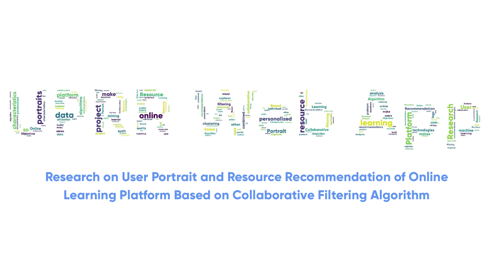

# UPRR Web App

Research on User Portrait and Resource Recommendation of Online Learning
Platform Based on Collaborative Filtering Algorithm.

This project is based on data mining, machine learning and other technologies, combined with algorithms such as collaborative filtering and clustering analysis, uses data logs for user portraits and resource portraits, and makes personalized resource recommendations for individual users, so as to build a visual function of Analytics Platform.
Research Objectives In order to make full use of the data of the online learning platform, this project mines the resource characteristics and learner characteristics behind the data, and explores the resource utilization of the online learning platform, so as to make personalized recommendation of learning resources to improve the quality of online learning.

Funding by College Students' Practice Innovation Project.

